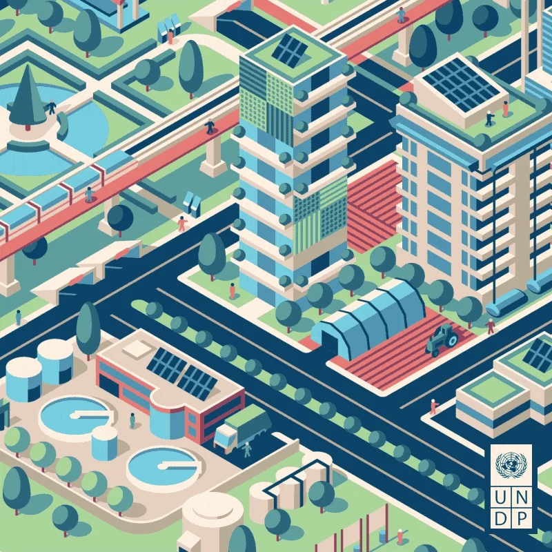

# Sostenibilidad en el desempeño profesional y personal

# Índice

1.1.- [Introducción](introduccion.md)

1.2.- [Desempeño profesional y personal](desempeño.md)

1.3.- [Riesgos y oportunidades que representan los ODS](riesgos.md)

1.4.- [Medidas y oportunidades para atender los retos ambientales desde el entorno personal y profesional](medidas.md)

1.5.- [Prácticas sostenibles en el ambiente personal](practicas.md)

[Conclusiones](conclusiones.md)

[Mapa conceptual](mapa.md)

[Glosario](glosario.md)

# Referencias

[Agenda2030](https://somosiberoamerica.org/tribunas/agenda-2030-para-el-desarrollo-sostenible-7-riesgos-7-oportunidades/)

# Autores

[IBL](https://github.com/IvanBL8/Desempeno-profesional)

[DSR](https://github.com/JohnDSil/Desempeno-profesional)

[GCR](https://github.com/Guille98-ASIR/Desempeno-profesional)
