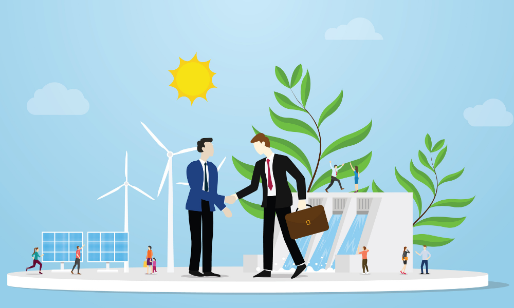

 # Prácticas sostenibles en el ambiente personal

## 1. Usa eficientemente la energía.

Realiza auditorías energéticas de tus procesos e instalaciones, te ayudará a saber si estás utilizando las mejores técnicas disponibles. 
Revisa periódicamente tus consumos y los aislamientos térmicos en equipos de frío y calor.

## 2. Gestiona el agua de forma responsable

Es importante realizar un control periódico de tus consumos y aplicar las mejores técnicas disponibles.
Piensa cómo puedes reducir el consumo o reutiliza algunas corrientes de agua de la instalación.

## 3. Busca nuevas oportunidades para valorizar tus residuos

Entre estas oportunidades, el aprovechamiento de las sinergias industriales, que permitan valorizar subproductos para convertirlos en materias primas u otros recursos de utilidad para otras empresas
Por ejemplo, la producción de biogás o biomasa, la transformación en enmiendas o fertilizantes, la extracción de productos o sustancias de valor.

## 4. Optimiza los envases de tus productos

Realiza un plan de prevención de envases específico. Utiliza nuevos materiales más biodegradables.

## 5. Calcula la huella ambiental

Calcula la huella ambiental de tu actividad e identifica objetivos de mejora. 
Técnicas como el Análisis del Ciclo de Vida (ACV) identifica el impacto medioambiental de un producto, proceso o servicio a lo largo de las diferentes etapas de su ciclo de vida.

## 6. Mejora la gestión

Mejora la gestión de los materiales y residuos peligrosos.
El rápido crecimiento de la población y su concentración en las grandes poblaciones han crecido los residuos urbanos generados

## 7. Sensibiliza

Sensibiliza y ofrece formación ambiental a los trabajadores.
